# 👋 Hey, I'm David Zarza

**Principal Security Consultant | Security Architect | DevSecOps Engineer**

Transforming 15+ years of offensive security expertise into secure-by-design systems. Specializing in embedding security automation into development lifecycles and building production-grade security platforms.

🎯 **Current Focus:** Evolving from penetration testing into **Security Architecture** and **DevSecOps** - where red team thinking meets secure system design.

[](https://linkedin.com/in/davidzarzaluna)
[](https://x.com/deifzar)
[](https://deifzar.github.io/)

---

## 🎯 What I Do

I specialize in **offensive security** and **penetration testing**, with a focus on building scalable, enterprise-grade security tooling. My work centers around creating automated, intelligent systems that help organizations identify and manage vulnerabilities before attackers do.

### 🔐 Current Focus: CPTM8 Ecosystem

I'm actively developing **CPTM8** (Cybersecurity Penetration Testing M8) - a comprehensive microservices ecosystem designed for continuous penetration testing and vulnerability management at scale.

---

## 🏗️ DevSecOps Infrastructure

Demonstrating **Infrastructure as Code** and **security-first architecture** through production-grade deployments:

| Repository | Stack | Description |
|------------|-------|-------------|
| [**vulnmngm-pipeline**](https://github.com/deifzar/vulnmngm-pipeline) | Terraform, Ansible, Azure, AWS, Groovy, JFrog | DevSecOps pipeline with shift-left security - Jenkins CI/CD, SonarQube SAST, Trivy container scanning, JFrog Artifactory and automated infrastructure provisioning |
| [**cptm8-k8s-stack**](https://github.com/deifzar/cptm8-k8s-stack) | Kubernetes, Helm, Kustomize | Cloud-native deployment orchestrating 13 microservices across AWS EKS, GCP GKE, and Azure AKS with observability and multi-environment support |

---

## 🚀 Featured Project: DashboardM8

**DashboardM8** is the flagship UI for the CPTM8 ecosystem - a production-grade, enterprise cybersecurity vulnerability management and penetration testing dashboard.

### ✨ Key Features

- **🏢 Dual-Database Architecture** - Optimized for performance and data integrity
- **👥 Real-Time Collaboration** - Built-in chat and notification system for security teams
- **📊 Enterprise-Grade Analytics** - Comprehensive risk assessment and vulnerability tracking
- **🎯 Asset Management** - Full lifecycle management of domains, hostnames, and network assets
- **📝 Automated Reporting** - Generate professional security reports on demand
- **🔄 Microservices Integration** - Seamlessly connects with the CPTM8 backend ecosystem

---

## 📸 DashboardM8 in Action

### 🔑 Authentication & Security
<div align="center">
  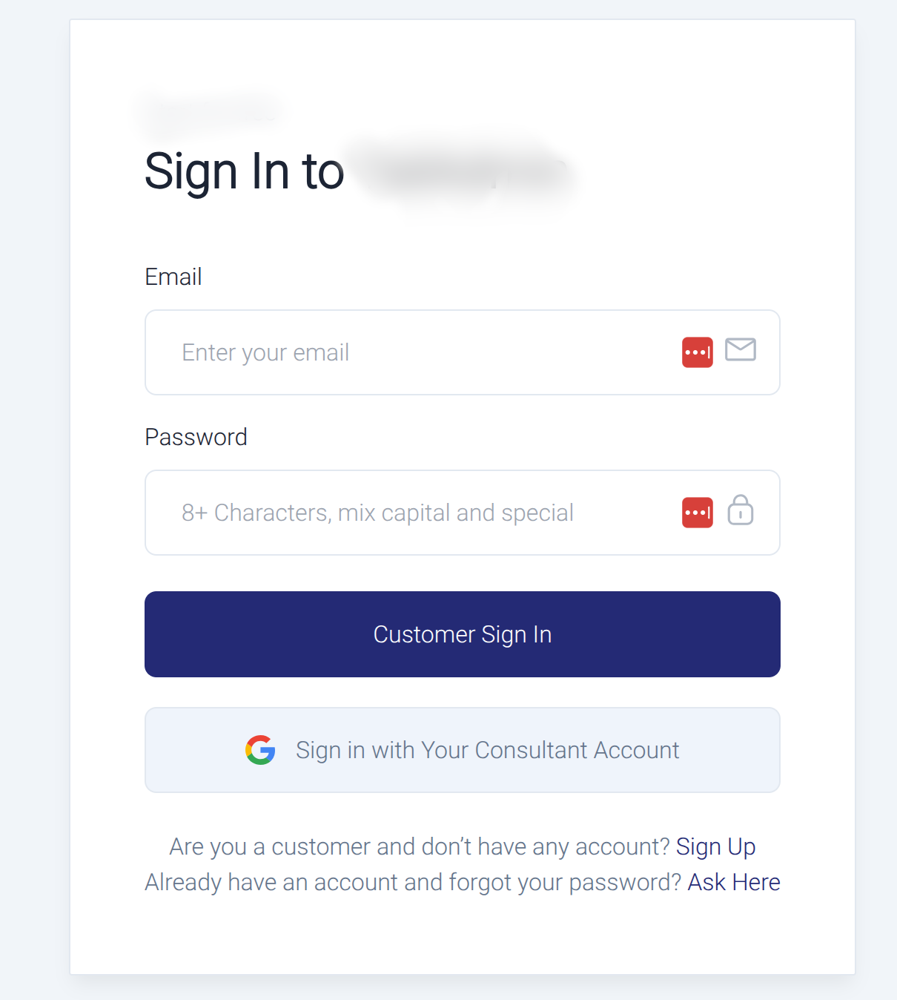
  <p><i>Enterprise-grade authentication with secure session management</i></p>
</div>

---

### 🏠 Command Center
<div align="center">
  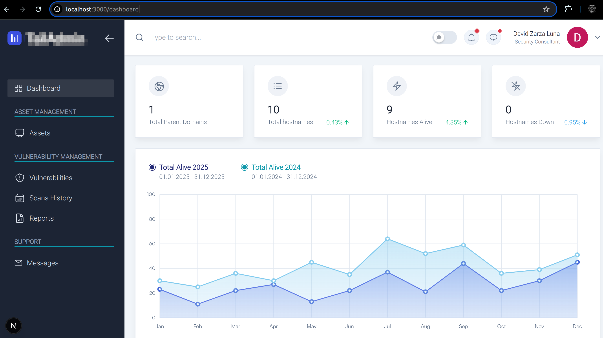
  <p><i>Centralized dashboard providing real-time security posture overview</i></p>
</div>

---

### 🔔 Real-Time Notifications
<div align="center">
  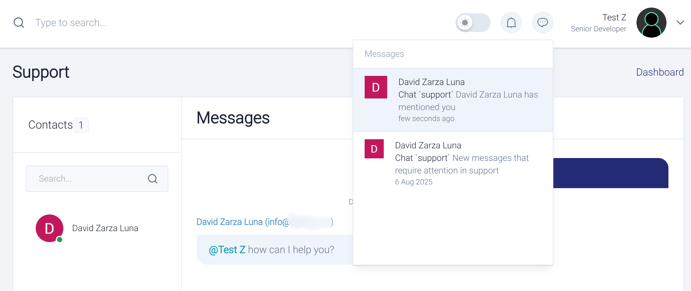
  <p><i>Instant team notifications and collaboration features</i></p>
</div>

---

### 🎯 Asset Management

<div align="center">
  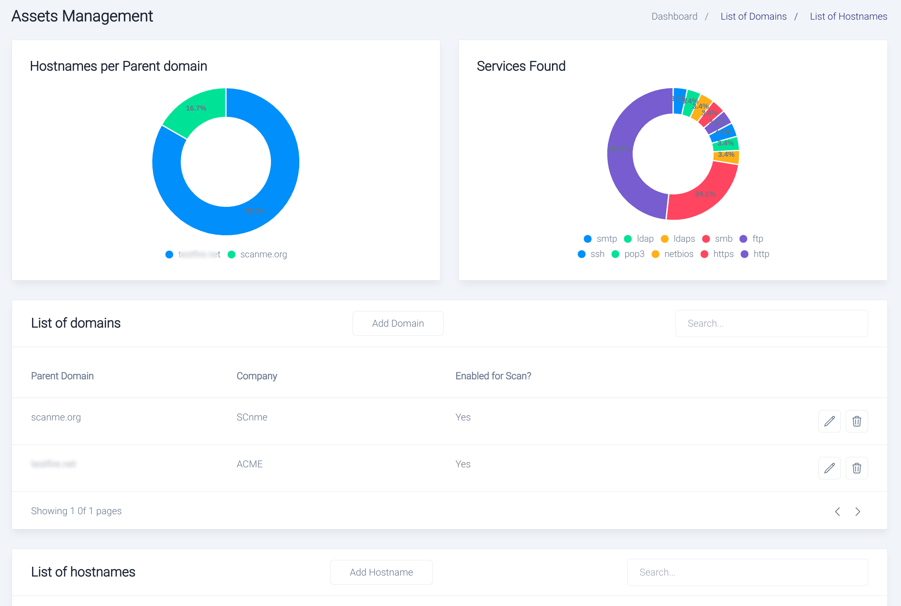
  <p><i>Comprehensive asset inventory and management system</i></p>
</div>

<div align="center">
  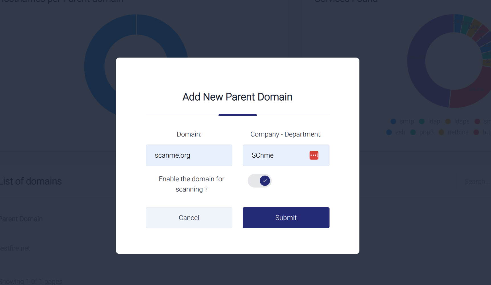
  <p><i>Quick asset onboarding with intelligent domain scanning</i></p>
</div>

<div align="center">
  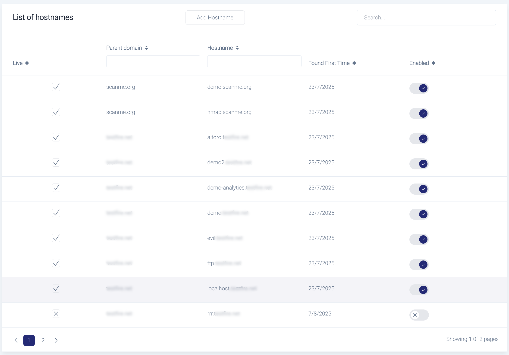
  <p><i>Detailed hostname discovery and tracking</i></p>
</div>

<div align="center">
  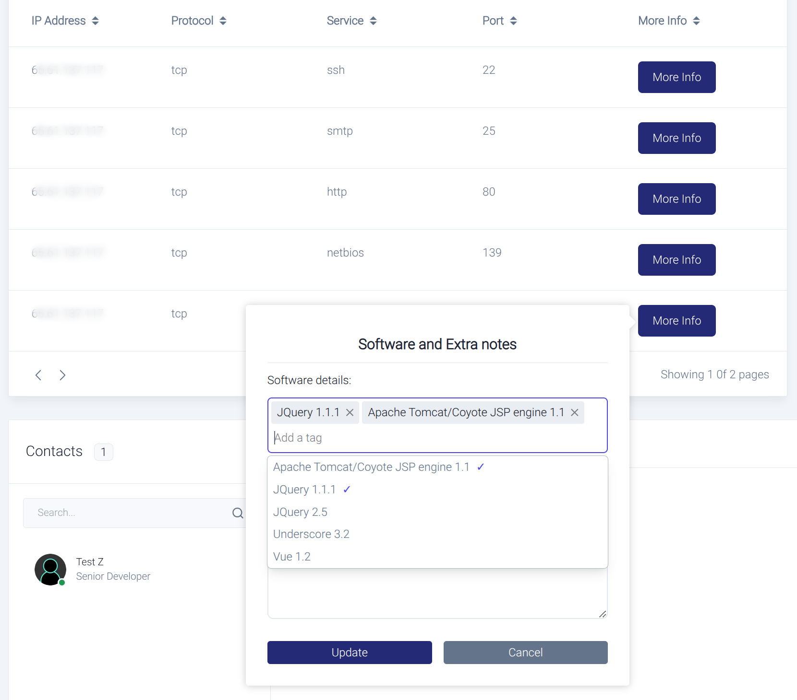
  <p><i>Deep-dive into individual assets with port scanning and software fingerprinting</i></p>
</div>

---

### 🛡️ Vulnerability Management

<div align="center">
  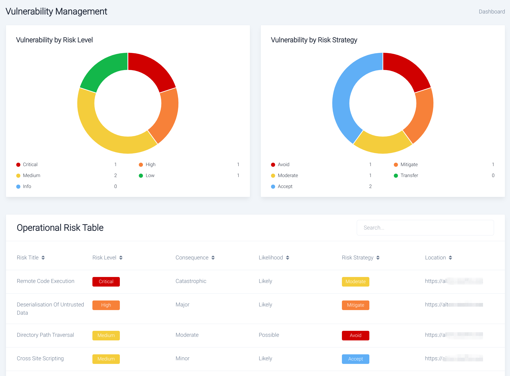
  <p><i>Enterprise-wide vulnerability risk assessment and prioritization</i></p>
</div>

<div align="center">
  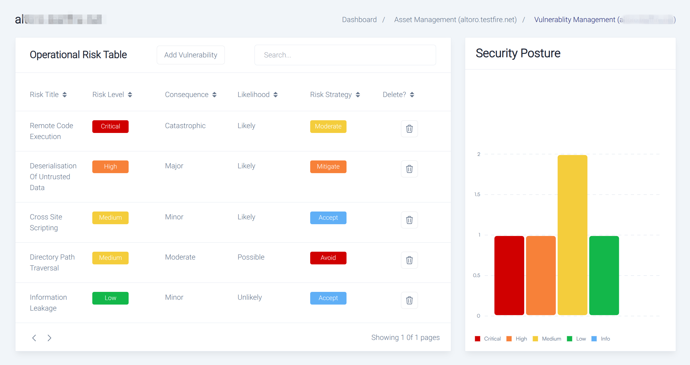
  <p><i>Granular risk analysis for individual assets</i></p>
</div>

<div align="center">
  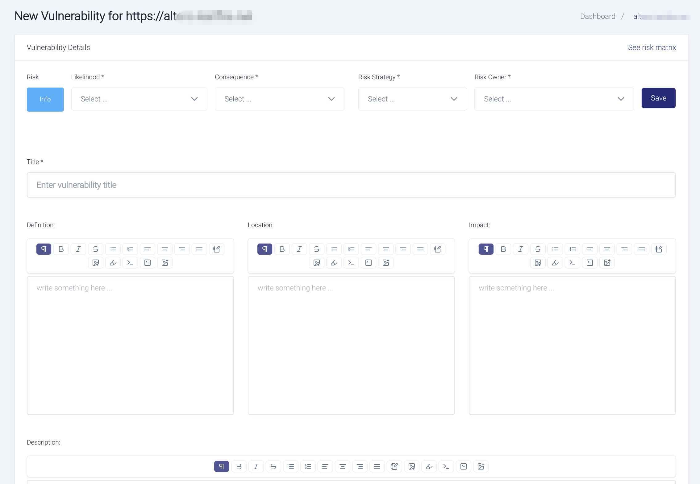
  <p><i>Manual vulnerability documentation and tracking</i></p>
</div>

<div align="center">
  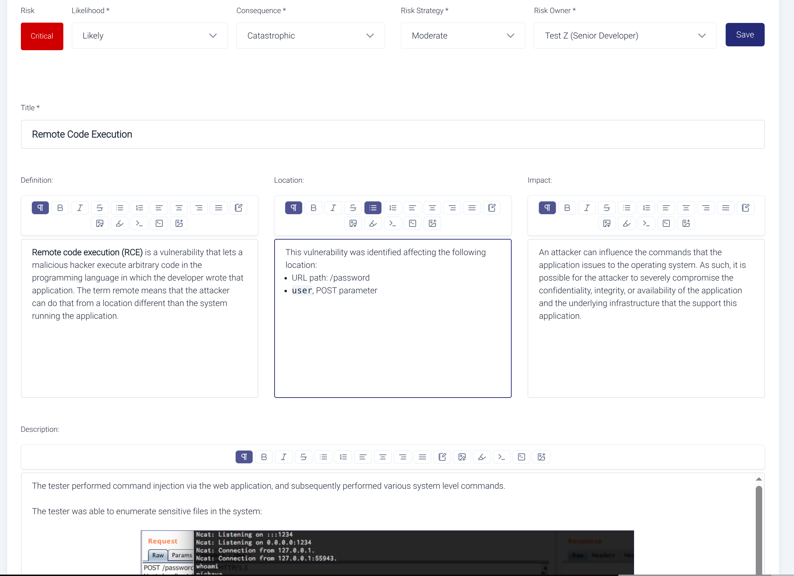
  <p><i>Comprehensive vulnerability details with CVSS scoring and remediation guidance</i></p>
</div>

<div align="center">
  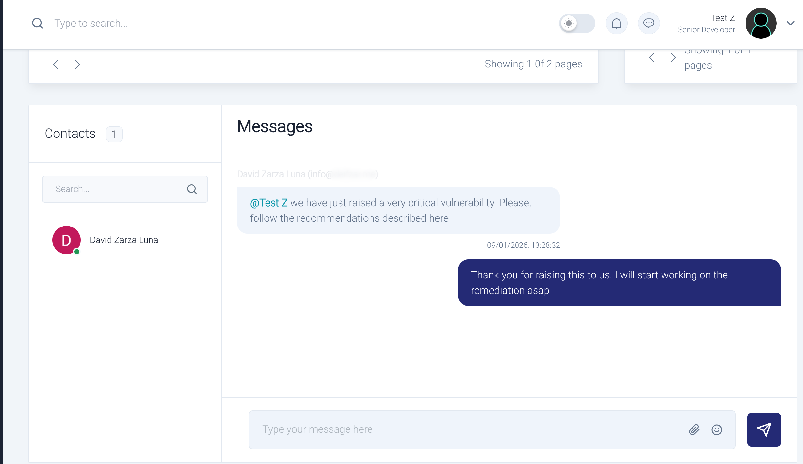
  <p><i>Built-in collaboration tools for security team coordination</i></p>
</div>

---

### 📊 Professional Reporting

<div align="center">
  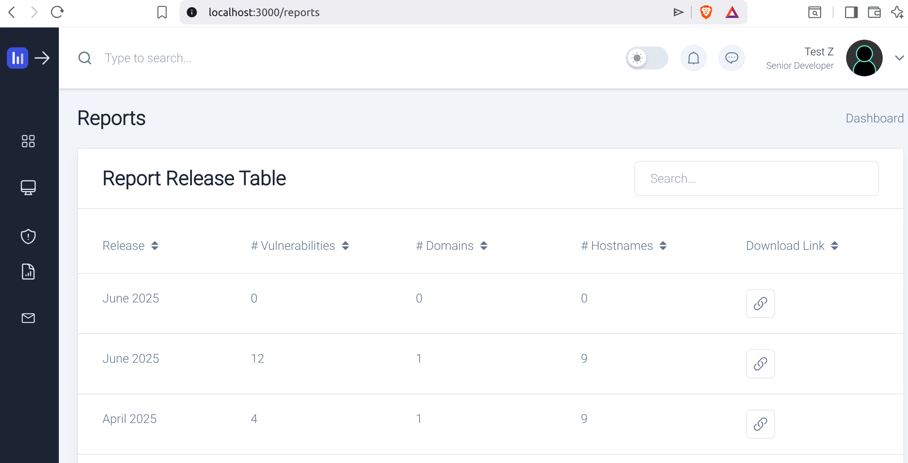
  <p><i>Automated professional security report generation and management</i></p>
</div>

---

## 🛠️ CPTM8 Ecosystem Components

The CPTM8 platform consists of specialized microservices, each designed for specific security testing functions:

| Repository | Language | Purpose |
|------------|----------|---------|
| **DashboardM8** | TypeScript | Primary UI and user interface |
| **SocketM8** | TypeScript | Real-time WebSocket communication layer |
| **OrchestratOrM8** | Go | Microservices orchestration and coordination |
| **ReportingM8** | Go | Automated security report generation |
| **KatanaM8** | Go | Automated scanning and reconnaissance |
| **NumM8** | Go | Asset enumeration and discovery |
| **AsmM8** | Go | Attack surface management |

---

## 💼 Technical Expertise

```yaml
Security:
  - Penetration Testing
  - Vulnerability Assessment
  - Security Architecture
  - Offensive Security
  - Red Team Operations
  - Attack Surface Management

Development:
  - Go (Primary)
  - TypeScript/JavaScript
  - Microservices Architecture
  - RESTful APIs
  - WebSocket Communication
  - Database Design (SQL/NoSQL)

DevOps & Infrastructure:
  - Docker & Containerization
  - CI/CD Pipelines
  - Cloud Security
  - Distributed Systems
```

---

## 📈 GitHub Stats


---

## 🤝 Let's Connect

I'm always interested in collaborating on security projects, discussing offensive security techniques, or exploring opportunities in cybersecurity consulting.

- 💼 [LinkedIn](https://linkedin.com/in/davidzarzaluna)
- 🐦 [X (Twitter)](https://x.com/deifzar)
- 🌐 [Personal Website](https://deifzar.github.io/)
- 📧 Open to consulting opportunities and collaborations

---

<div align="center">
  <i>Building secure systems, one vulnerability at a time.</i>

  ⭐️ If you find my work valuable, consider starring my repositories!
</div>
